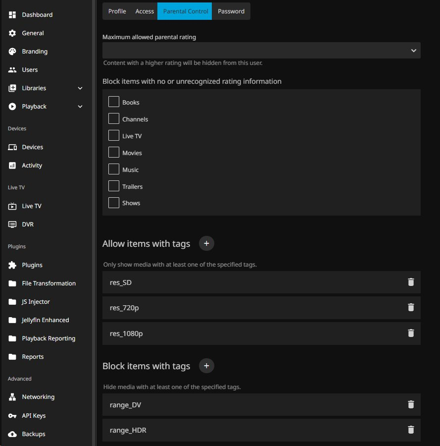

# Jellyfin Media Tags Plugin
<p align="center">
  
</p>

## About
The MediaTags plugin automates tagging media in your library with information about their resolution and HDR content.

In addition to implementing more comprehensive information than Jellyfin's built in Video Types feature, the generated tags can be used with User Permissions.

For example if you have set up profiles which only connect to your server from devices with no 4K Resolution or HDR support you can use the Parental Controls to only display non 4K SDR media for the selected profiles.  
Naturally the inverse is possible as well. The Kodi client on my TV which uses the Jellyfin for Kodi add-on is set to *only* access 4K or HDR/Dolby Vision content.

This plugin is a fork of the [Jellyfin Language Tags](https://github.com/TheXaman/jellyfin-plugin-languageTags) plugin that offers the same functionality for languages from audio tracks and subtitles.

## Details
The MediaTags plugin adds tags to the items contained in your Jellyfin personal collection based on the resolution and color range of the video tracks. This plugin will never modify the tags present in your actual media files, it will only create new tags which will be applied to the relevant "item" present in the Jellyfin's internal database. It uses Jellyfin’s MediaStreams API to read stream metadata directly (no FFmpeg), delivering a fast and reliable scan.  

## Features
- Tagging & Display
  - Configurable tag prefixes for resolution and range tags (with validation)
  - Visual reoslution selector for easier configuration
  - Tagging for non-media items (e.g., actors, studios) with toggles*
  - TV Show Tagging: optionally restrict tagging to the root Series only (skip Seasons and Episodes)

- Operations
  - Automatic scheduled scan (default: 24h)
  - Works with movies, series (seasons/episodes), and collections
  - Asynchronous mode for speed; synchronous mode for low-end devices
  - Force refresh options when files are replaced or for troubleshooting
 
- Performance & Architecture
  - Direct extraction of resolution/hdr tags from metadata

## Example Usage
Restrict content via user Parental Controls using the "Allow items with tags" rule in combination with LanguageTags:
```
res_4K
range_DV
```
This shows only items that with either 4K resolution or Dolby Vision HDR content.


### Parental Control screenshot
These are the possible Parental Control settings you could use for an Non-4K and non-HDR only user:
<p align="center"></p>

## Configuration
- Tag prefixes
  - Resolution (default): res_
  - Video range (default): range_
  - Validation ensures safe characters
- TV Show Tagging
  - Disabled (default): Episodes, Seasons, and Series all receive media tags
  - Enabled (Tag Series only): only the root Series item is tagged; media data is still read from episodes/seasons and aggregated upward. Prevents Jellyfin's tag view from being flooded with hundreds of individual episode entries.
  - Note: enabling this does not remove previously applied tags from episodes/seasons. Run "Remove ALL media tags" first for a clean state.
- Non-media tagging
  - Enable tagging for actors, studios etc. if needed
- Scan mode
  - Asynchronous (default) or synchronous for low-end devices
- Schedule
  - Configure periodic scans (default every 24h)

## Installation
Add this repository in Jellyfin: Plugins -> Catalog -> Add Repository:
```
https://raw.githubusercontent.com/Thertzlor/jellyfin-plugin-mediaTags/main/manifest.json
```

## Build (only needed for development!)
1. Clone or download the repository
2. Install the .NET SDK >= 9.0
3. Build:
```sh
dotnet publish --configuration Release
```
4. Copy the resulting output to the Jellyfin plugins folder

## What’s New

### v0.1.2.0
* Removal of search function in configuration, as it wasn't neccesary.

### v0.1.1.0
* Optimizations
* Overhauled options menu
* More specialized HDR/DV/HDR10plus logic

### v0.0.1.0

* Initial fork from LanguageTags.

---
## *NON-MEDIA ITEMS - Why would you want this?
Tagging non-media items (actors, directors, studios but, also, photo, photo-albums, album artists, music albums, etc.) is necessary in some cases.
If you want to use the Jellyfin "Allow" Parental Control rule, then you need to make sure that **everything** is properly tagged, otherwise Jellyfin will hide large parts of your library.

EXAMPLE:  
Say that you want a user to be able to explore only the part of the catalgue that contains 4K video or HDR content, then you might be tempted to use only the following "Allow" rules:
```
res_4K
range_HDR
```
But, by doing this, the 4K user will not be able to see the People's pages (director, actors, other cast members, etc.). Even more so, if your catalogue contains music, books or photos, these will be obscured, too. For this reason, MediaTags implements something called "non-media items" which, essentially, bulk tags everything with the tag "item" (tag can be modified) that you select in the settings page. When running the daily scheduled task, MediaTags will take care of all the newly created non-media items too. So it is a set-and-forget feature that you'll only need to setup once.

Then in the Parental Control Allow rules, make sure to add the following:
```
res_4K
range_HDR
item
```
## Todos
* Permit user defined resolutions.
* Check how exactly the internal Jellyfin SD/HD/FUllHD logic works, for comparison.